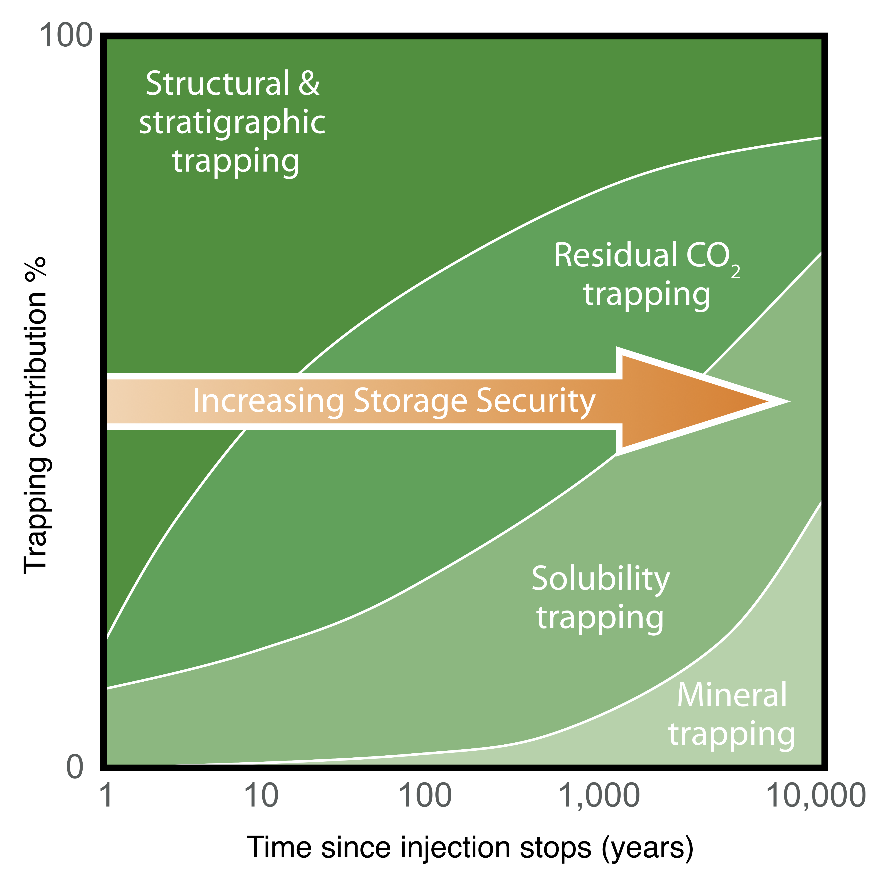

# Introduction

```{=latex}
\pagenumbering{arabic}
```

The solubility trapping of geologically sequestered CO$_2$ represents one of the most secure, long-term solutions to underground geological carbon storage - second only to the much slower process of mineral trapping - because unlike CO$_2$ in liquid phase, brine containing dissolved CO$_2$ becomes denser and thus does not present any risk of rising by buoyancy forces to the top of the geological formation and escaping through structural faults in the cap rock. Convective dynamics driven by such density contrasts have been well-studied in the literature on porous media flows \cite{hewitt_convective_2013,slim_onset_2010}. However, the solubility of CO$_2$ in water is relatively low and the timescale for the onset of convection processes is estimated to be large \cite{huppert_fluid_2014}. One tier down from solubility trapping in the hierarchy of storage security \cite{metz_ipcc_2005} (see @fig-ipcc) is capillary trapping, whereby small amounts of CO$_2$ are left behind in the wake of a migrating CO$_2$ current. The interplay between capillary and solubility trapping provides the motivation for the research forming this thesis. As small bubbles of CO$_2$ form and are left trapped in pore spaces, nearby brine is expected to partially dissolve these bubbles and become saturated. If the saturated brine is then replaced by unsaturated brine, due to mechanisms such as convection, exchange flow or background hydrogeologic flow, the capillary-trapped CO$_2$ would further diminish by dissolution, and potentially dissolve entirely.

::: {#fig-ipcc}

{#fig-ipcc width=70%}

Mechanisms of geological CO$_2$ storage, reproduced from @metz_ipcc_2005.
:::

\begin{figure}[ht]
\begin{center}
\includegraphics[width=1.0\textwidth]{figures/anticline.pdf}
\end{center}
\caption{Schematic of geologically-sequestered CO$_2$ in an anticline formation. Single-phase CO$_2$ is injected at a point downslope of the apex, but rises towards the apex because it is more buoyant than the surrounding brine. Capillary-tragged CO$_2$ is left behind in its wake. Further rising of the buoyant CO$_2$ is halted by the impermeable cap rock layer, though leakage may still occur through faults, or over a much longer time scale if the cap rock has low but non-zero permeability. Some anticline formations may also have a background hydrogeological flow from on side to the other. Boxes 1, 2 and 3 isolate the different regions and flows within the anticline formations that research into the fluid dynamics of carbon sequestration has investigated so far with simplified mathematical and numerical models. A simplified model for box 4 is proposed in the following section.}
\label{fig:Anticline}
\end{figure}

## One

## Two